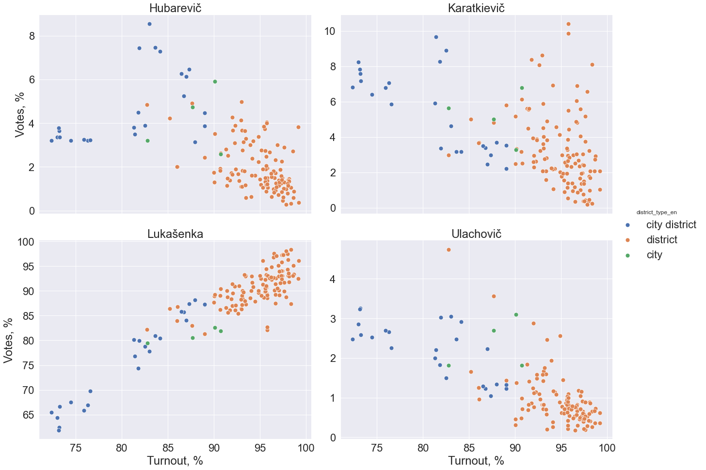
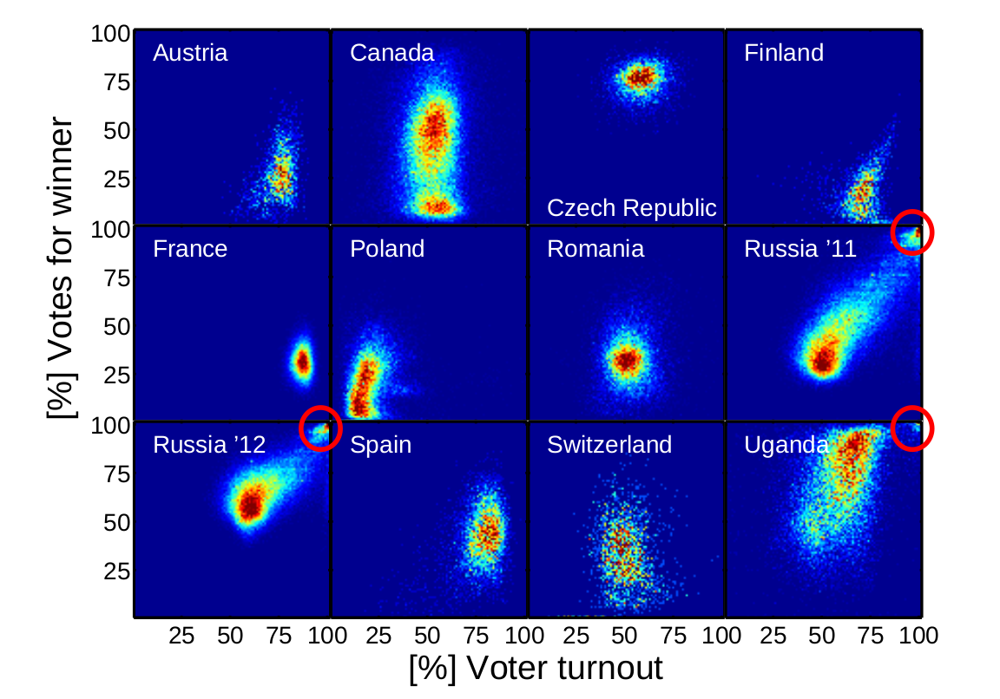
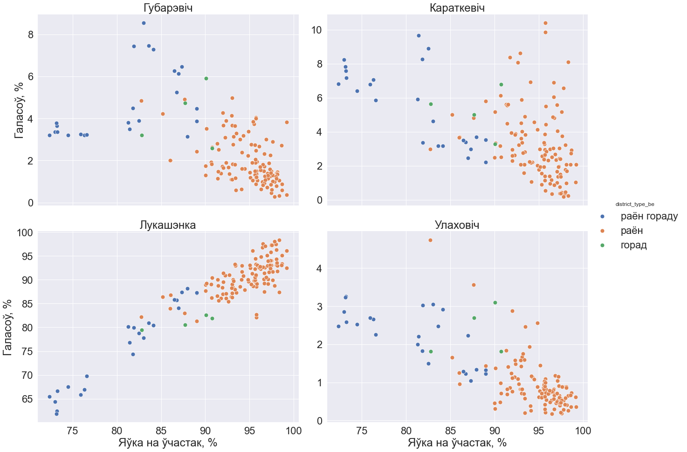

# Presidential Elections in Belarus 2015<br>Выбары прэзідэнта Рэспублікі Беларусь 2015

## English version (Беларуская версія знаходзіцца ніжэй)
This repository contains simple analysis of Presidential Elections in Belarus in 2015.

Analysis is based on the approach proposed in the following paper: [Statistical detection of systematic election irregularities (Klimek et al)](https://arxiv.org/abs/1201.3087). In addition to building plots only for a winner candidate (original approach), this analysis builds same plots for all candidates.

The data was taken from the [official web page](http://www.rec.gov.by/dokumenty) of the Central Election Commission (CEC) of Belarus [(wikipedia)](https://en.wikipedia.org/wiki/Central_Election_Commission_of_Belarus). Unfortunately, the CEC page is currently not available (in 2023). But you can access the data using, for example, the following [2017-08-01 WayBack Machine dump](https://web.archive.org/web/20170801145831/http://www.rec.gov.by/dokumenty) (a dump from the Internet Archive).

CEC provides "districts" as smallest territorial units. Data for individual Polling stations is not available.

### Results
Main artifacts are "**Voter Turnout vs Votes for candidate**" joint distribution plots for each candidate:


Along with static plots, **interactive dashboards** were also built to make it easier to explore the data:


These and other plots and dashboards are built in `notebooks/explore.ipynb` jupyter notebook.

### Approach
[Statistical detection of systematic election irregularities (Klimek et al)](https://arxiv.org/abs/1201.3087) paper proposes that election irregularities could be found as clusters with high Voter turnout and high Votes for winner candidate on "Turnout vs Votes" plot. Such clusters are highlighted with red circles on the image below (from the original paper):


--------

## Беларуская версія (Belarusian version)

### Апісаньне
Рэпазіторый змяшчае просты аналіз Прэзідэнцкіх выбараў у Беларусі 2015 года.

Аналіз засанаваны на падыходзе, прапанаваным ў наступнай публікацыі: [Statistical detection of systematic election irregularities (Klimek et al)](https://arxiv.org/abs/1201.3087). У дадатак да пабудовы графікаў толькі для пераможцы выбараў (арыгінальны падыход з публікацыі), у аналізе аналагічныя графікі будуюцца для ўсіх кандыдатаў.

Даныя браліся з [афіцыйнага сайта](http://www.rec.gov.by/dokumenty) Цэнтральнай камісіі Рэспублікі Беларусь па выбарах і правядзенні рэспубліканскіх рэферэндумаў (далей - ЦВК). На жаль, дадзеная старонка зараз недаступная (на момант 2023). Але яна захавалася ў інтэрнэт архіве, і даныя можна атрымаць, напрыклад, праз наступны [дамп WayBack Machine ад 1 жніўня 2017](https://web.archive.org/web/20170801145831/http://www.rec.gov.by/dokumenty).

Даныя ЦВК выкарыстоўваюць раён як мінімальную тэрытарыяльную адзінку. Даныя для асобных выбарчых участкаў недаступныя.

### Рэзультаты
Асноўным артэфактам з'яўляюцца графікі супольнага размеркавання "**Яўкі на ўчастак і Галасоў за кандыдата**" для кожнага з кандыдатаў.


Акрамя статычных графікаў былі пабудаваныя і **інтэракатыўныя дэшборды** для лёгкага аналіза даных. 

Дэшборд дазваляе:
  * з лёгкасцю вызначыць на графіку тэрытарыяльную адзінку
  * пераключацца паміж кандыдатамі
  * фільтраваць даныя з дапамогай легенды (вобласць альбо тып тэрытарыяльнай адзінкі)

Графікі і дэшборды пабудаваныя ў наступным ноўтбуку: `notebooks/explore.ipynb`.

### Падыход

Публікацыя [Statistical detection of systematic election irregularities (Klimek et al)](https://arxiv.org/abs/1201.3087) прапаноўвае выяўляць анамальныя выбарчыя ўчасткі як участкі з высокай яўкай і высокай доляй галасоў за кандыдата, які перамог на выбарах. Такія выбарчыя ўчасткі абведзеныя чырвонымі кругамі на выяве ніжэй (з арыгінальнай публікацыі):


### Падрыхтоўка даных (Data preparation)

1. Даныя з `.pdf` файлаў са справаздачамі ЦВК па кожнай з абласцей 
пераносіліся ў `.xlsx` файл. 

   Атрыманы `.xlsx` файл знаходзіцца ў `data/original/Vybary_2015_rajonnaja_statystyka.xlsx`

2. Табліцы знутры `.xlsx` файлу аб'ядноўваліся ў адну агульную табліцу. 
   Назва калонак змянялася на зручную ў апрацоўцы. 
   
   Атрыманы датасэт быў захаваны ў фармаце `.xlsx` і `.csv`:
   `data/output/Vybary_2015.csv`  
   `data/output/Vybary_2015.xlsx`
   
Стварэнне датасэту па ўваходнай `.xlsx` табліцы з пункту 1
праводзіцца ў ноўтбуку `notebooks/create_dataset.ipynb`
   
### Праверка памылак у даных (Data quality checks)
Быў створаны ноўтбук для выўляення памылак 
пры пераносе даных з `.pdf` справаздачаў у табліцы, 
а таксама для праверкі магчымых памылак з боку ЦВК:

`notebooks/consistency_checks.ipynb`

#### Дарабіць (TODO)
Набор тэстаў у ноўтбуку не пакрывае наступныя калонкі:
* выбарцы агулам
* новыя выбарцы
* атрыманыя бюлетэні

Неабходна выявіць наяўнасць хібаў у гэтых калонках.

### Запуск коду (How to run the code)

Для запуску коду неабходна ўсталяваць `Python 3.7` і стварыць віртуальны асяродак:
```
python3 -m venv venv
source venv/bin/activate
pip3 install -r requirements.txt
```

Усталяваць асяродак аўтаматычна, а таксама наладзіць пашырэнні 
для Jupyter Notebook можна з дапамогай адмысловага скрыпту:

`$ source venv_creation.sh`

Іншы скрыпт запускае ноўтбукі:

`$ bash run_jupyter.sh` 

### Далейшая работа (Further work)

Для рэзультатаў выбараў былі пабудаваныя толькі асноўныя графікі, 
па аналогіі з графікамі ў даследаванні.

Сабраны датасэт можна выкарыстоўваць для правядзення далейшага большы дэтальнага аналізу.
Некаторыя ідэі для аналізу пазначаныя ў ноўтбуку. 